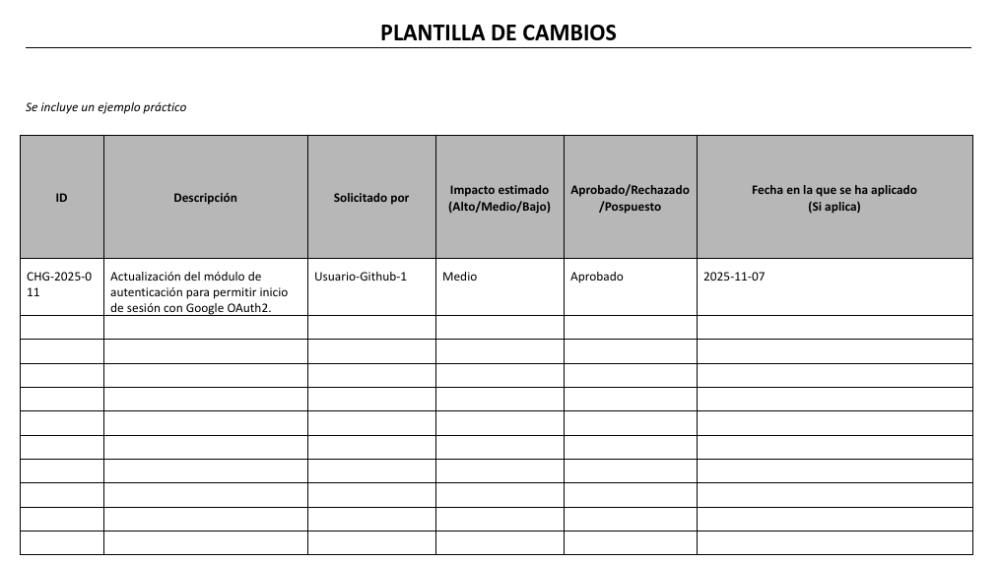
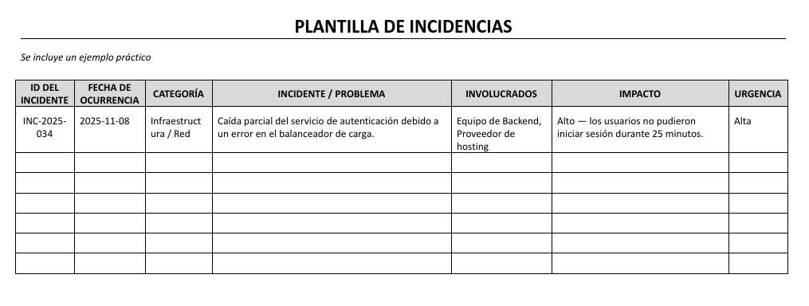
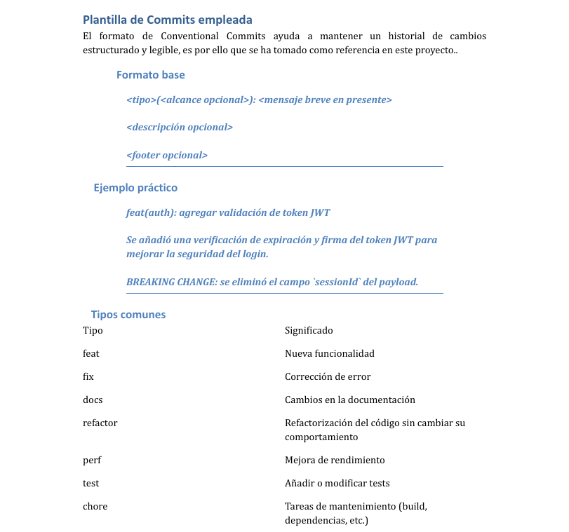

# Visual Templates Guide

This guide shows the available templates for different sections.

## Template 1: Template for changes

**Description:** This template must be used whenever a change is presented for review.

---

## Template 2: Template for incidents

**Description:** This template must be used whenever an incident occurs and must be recorded.

---

## Template 3: Template for commits

**Description:** this template must be used for any commit within the project.

